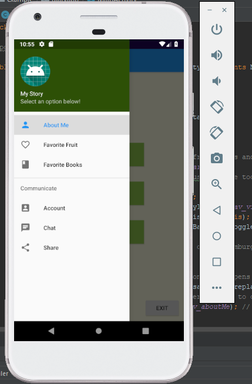
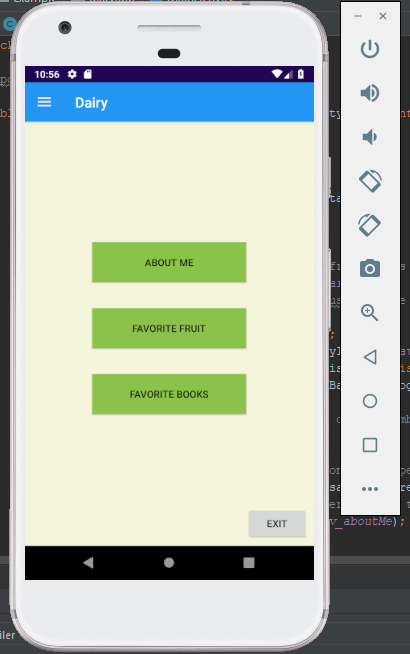
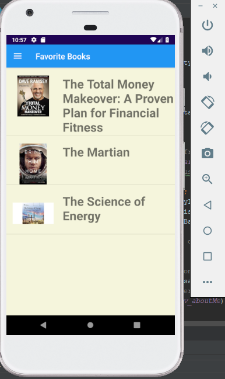
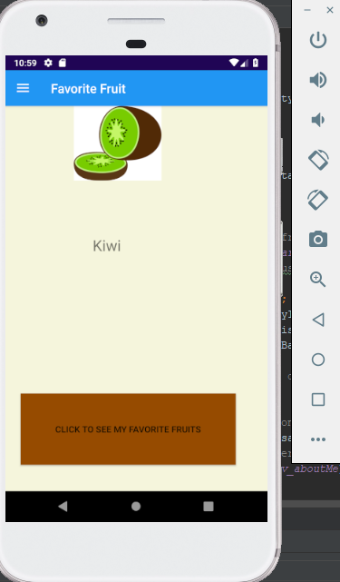
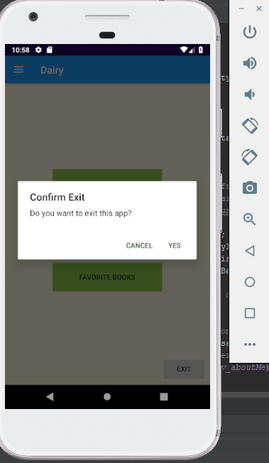

# DiaryApp
## Applying Android Studio Skills
The purpose of this project is to understand and become familiar with Java to dive into **Android development**.
This project has helped me learn a lot about all the files that are invloved in making a simple project. From understading **gradle, to XML markdown, mainActivity files, and learning constraint**. Andriod app development can get rather daunting compare to **C#** or **Python 3** but it's worth the trial :) 
Below are some images of what the app looks like:
#### Display of side-menu with the humbergar button on top

#### Main page

#### Display of My Favorite Books page

#### Display of My Favorite Fruits page

#### Confirmation button for Exiting the app

Bottom line, it was quite fun and painful to make this simple app... I guess I'll stick with expanding my skills in Python 3 instead!!

